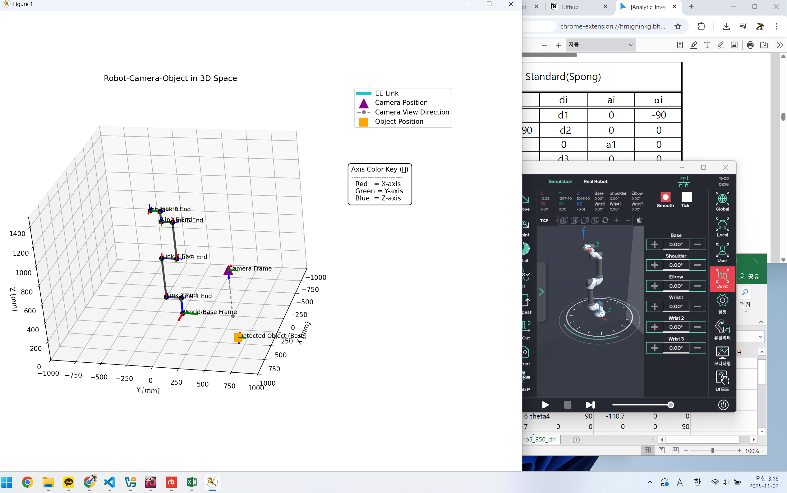

# 🤖 6축 로봇팔 3D 시뮬레이터 (FK & 좌표계 변환)

이 프로젝트는 6축 로봇팔(RB5-850)의 순기구학(Forward Kinematics)과 좌표계 변환을 시뮬레이션하는 Python 스크립트입니다.

스크립트(`main.py`) 내에 \*\*하드코딩된 값(관절 각도, 카메라 위치 등)\*\*을 기반으로 로봇팔의 자세, 카메라의 위치, 가상 객체의 변환된 위치를 3D 그래프로 시각화합니다.

-----

## 🚀 주요 기능

  * **객체 지향 설계:** `RobotArm`, `Camera`, `Transform3D` 클래스를 사용하여 코드를 모듈화하고 재사용성을 높였습니다.
  * **DH 파라미터 기반 순기구학 (FK):** `rb5_850_dh.csv` 파일에 정의된 Standard DH 파라미터를 기반으로 로봇의 실제 엔드 이펙터(EE) 포즈를 계산합니다.
  * **좌표계 변환:** `main.py`에 정의된 '카메라 기준 객체'(`T_cam_object`)를 '로봇 베이스 기준'(`T_base_object`)으로 변환합니다.
  * **3D 시각화:** `matplotlib`을 사용하여 로봇, 카메라, 객체의 3D 위치와 자세(RGB 축)를 직관적으로 보여줍니다.

-----

## ⚙️ 실행 방법

1.  **필요 라이브러리 설치:**

    ```bash
    pip install numpy scipy pandas matplotlib
    ```

2.  **DH 파라미터 생성 (최초 1회 실행):**
    `create_dh_csv.py` 스크립트를 실행하여 로봇팔의 DH 파라미터가 담긴 `rb5_850_dh.csv` 파일을 생성합니다.

    ```bash
    python create_dh_csv.py
    ```

3.  **메인 시뮬레이터 실행:**
    `main.py`를 실행하면 스크립트에 정의된 값을 바탕으로 3D 그래프가 나타납니다.

    ```bash
    python main.py
    ```

-----

## 🔧 스크립트 수정 가이드 (시나리오 변경)

터미널 입력 대신 `main.py` 파일의 변수 값을 직접 수정하여 시뮬레이션을 변경할 수 있습니다.

  * **로봇 자세 변경:**
    `[2] 로봇팔 생성 및 조작` 섹션의 `joint_angles` 리스트 값을 수정하여 로봇의 6개 관절 각도(도, `°`)를 변경합니다.

    ```python
    # [2] ...
    # 예: 'DH 기준 수직' 자세
    joint_angles = [0, 90, 0, -90, 0, 0] 
    robot.set_joint_angles(joint_angles)
    ```

  * **카메라 위치/자세 변경:**
    `[1] 카메라 설정` 섹션의 `T_base_cam` 생성 값(`x, y, z, rx, ry, rz`)을 수정하여 카메라의 캘리브레이션 값을 변경합니다.

    ```python
    # [1] ...
    T_base_cam = Transform3D.from_xyz_rpy(x=0.0, y=500.0, z=500.0, # <-- 이 값들
                                          rx=0.0, ry=-180.0, rz=0.0, 
                                          degrees=True)
    ```

  * **가상 객체 위치 변경:**
    `[4] 검출된 객체 포즈 변환` 섹션의 `T_cam_object` 생성 값(`x, y, z, rx, ry, rz`)을 수정하여 **카메라가 보는** 객체의 상대 위치를 변경합니다.

    ```python
    # [4] ...
    # 예: 카메라 정면 50cm(500mm)에 있는 객체
    T_cam_object = Transform3D.from_xyz_rpy(x=0.0, y=0.0, z=500.0, # <-- 이 값들
                                            rx=0, ry=0, rz=0, degrees=True)
    ```

-----

## 📸 3D 시각화 요소 설명

3D 그래프 창에는 다음과 같은 요소들이 표시됩니다.

  * **World/Base Frame (검정 원점 + 굵은 RGB 축):**
    모든 좌표의 기준이 되는 로봇 베이스의 원점입니다.

  * **Robot Arm (검정 선 + 청록색 EE):**
    `joint_angles` 변수에 설정된 각도로 서 있는 로봇팔입니다. 엔드 이펙터(EE)는 청록색(Cyan)으로 강조 표시됩니다.

  * **Camera Position (보라색 삼각형 `^`):**
    `T_base_cam` 값에 따라 로봇 베이스로부터 떨어진 카메라의 위치를 나타냅니다.

  * **Camera View Direction (회색 점선):**
    카메라의 Z축, 즉 카메라가 바라보는 시선 방향을 나타냅니다.

  * **Detected Object (주황색 네모 `s`):**
    `T_cam_object`로 정의된 객체의 포즈를 로봇 베이스 기준으로 변환한 `T_base_object`의 최종 위치를 나타냅니다.

  * **Axis Color Key (범례 옆 텍스트 상자):**
    모든 좌표계의 RGB 축이 의미하는 방향을 알려줍니다.

      * `Red` = **X축**
      * `Green` = **Y축**
      * `Blue` = **Z축**