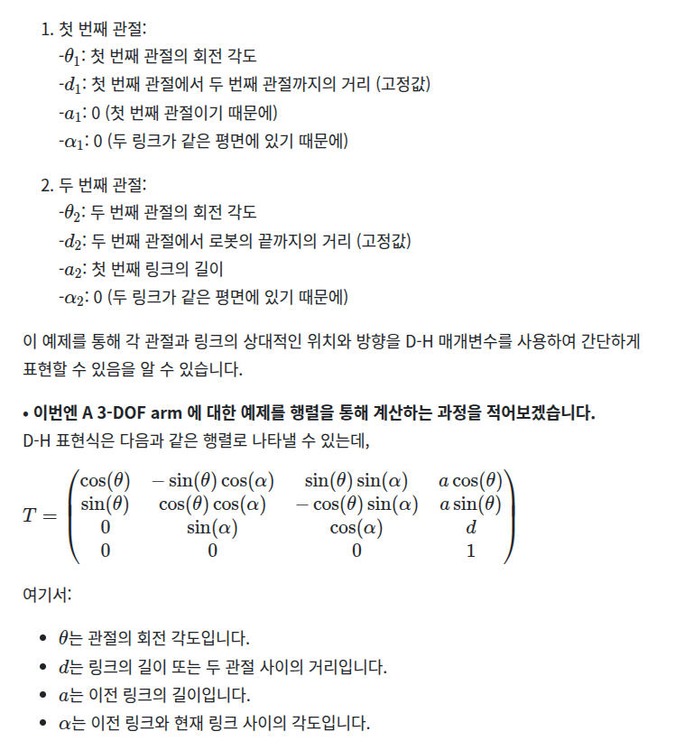
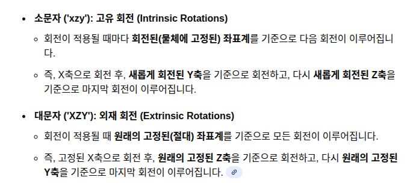

# 🤖 6축 로봇팔 3D 시뮬레이터 (FK & 좌표계 변환)

이 프로젝트는 6축 로봇팔(RB5-850)의 순기구학(Forward Kinematics)과 좌표계 변환을 시뮬레이션하는 Python 스크립트입니다.

rb850e 기준으로 제작되었습니다.

스크립트(`main.py`) 내에 \*\*하드코딩된 값(관절 각도, 카메라 위치 등)\*\*을 기반으로 로봇팔의 자세, 카메라의 위치, 가상 객체의 변환된 위치를 3D 그래프로 시각화합니다.

-----

## 🚀 주요 기능

  * **객체 지향 설계:** `RobotArm`, `Camera`, `Transform3D` 클래스를 사용하여 코드를 모듈화하고 재사용성을 높였습니다.
  * **DH 파라미터 기반 순기구학 (FK):** `rb5_850_dh.csv` 파일에 정의된 Standard DH 파라미터를 기반으로 로봇의 실제 엔드 이펙터(EE) 포즈를 계산합니다.
  * **좌표계 변환:** `main.py`에 정의된 '카메라 기준 객체'(`T_cam_object`)를 '로봇 베이스 기준'(`T_base_object`)으로 변환합니다.
  * **3D 시각화:** `matplotlib`을 사용하여 로봇, 카메라, 객체의 3D 위치와 자세(RGB 축)를 직관적으로 보여줍니다.

-----

## ⚙️ 실행 방법

1.  **필요 라이브러리 설치:**

    ```bash
    pip install numpy scipy pandas matplotlib
    ```

2.  **DH 파라미터 생성 (최초 1회 실행):**

    

    

    reference: https://velog.io/@joongwon00/Robotics-1.D-H-%ED%8C%8C%EB%9D%BC%EB%AF%B8%ED%84%B0

    `dhparameter_maker.py` 스크립트를 실행하여 로봇팔의 DH 파라미터가 담긴 `rb5_850_dh.csv` 파일을 생성합니다.

    ```bash
    python create_dh_csv.py
    ```

4.  **메인 시뮬레이터 실행:**
    `main.py`를 실행하면 스크립트에 정의된 값을 바탕으로 3D 그래프가 나타납니다.

    ```bash
    python main.py
    ```

-----

## 🔧 스크립트 수정 가이드 (시나리오 변경)

터미널 입력 대신 `main.py` 파일의 변수 값을 직접 수정하여 시뮬레이션을 변경할 수 있습니다.

  * **로봇 자세 변경:**
    `[2] 로봇팔 생성 및 조작` 섹션의 `joint_angles` 리스트 값을 수정하여 로봇의 6개 관절 각도(도, `°`)를 변경합니다.

    ```python
    # [2] ...
    # 예: 'DH 기준 수직' 자세
    joint_angles = [0, 90, 0, -90, 0, 0] 
    robot.set_joint_angles(joint_angles)
    ```

  * **카메라 위치/자세 변경:**
    `[1] 카메라 설정` 섹션의 `T_base_cam` 생성 값(`x, y, z, rx, ry, rz`)을 수정하여 카메라의 캘리브레이션 값을 변경합니다.

    ```python
    # [1] ...
    T_base_cam = Transform3D.from_xyz_rpy(x=0.0, y=500.0, z=500.0, # <-- 이 값들
                                          rx=0.0, ry=-180.0, rz=0.0, 
                                          degrees=True)
    ```

  * **가상 객체 위치 변경:**
    `[4] 검출된 객체 포즈 변환` 섹션의 `T_cam_object` 생성 값(`x, y, z, rx, ry, rz`)을 수정하여 **카메라가 보는** 객체의 상대 위치를 변경합니다.

    ```python
    # [4] ...
    # 예: 카메라 정면 50cm(500mm)에 있는 객체
    T_cam_object = Transform3D.from_xyz_rpy(x=0.0, y=0.0, z=500.0, # <-- 이 값들
                                            rx=0, ry=0, rz=0, degrees=True)
    ```

-----

## 📸 3D 시각화 요소 설명

3D 그래프 창에는 다음과 같은 요소들이 표시됩니다.

  * **World/Base Frame (검정 원점 + 굵은 RGB 축):**
    모든 좌표의 기준이 되는 로봇 베이스의 원점입니다.

  * **Robot Arm (검정 선 + 청록색 EE):**
    `joint_angles` 변수에 설정된 각도로 서 있는 로봇팔입니다. 엔드 이펙터(EE)는 청록색(Cyan)으로 강조 표시됩니다.

  * **Camera Position (보라색 삼각형 `^`):**
    `T_base_cam` 값에 따라 로봇 베이스로부터 떨어진 카메라의 위치를 나타냅니다.

  * **Camera View Direction (회색 점선):**
    카메라의 Z축, 즉 카메라가 바라보는 시선 방향을 나타냅니다.

  * **Detected Object (주황색 네모 `s`):**
    `T_cam_object`로 정의된 객체의 포즈를 로봇 베이스 기준으로 변환한 `T_base_object`의 최종 위치를 나타냅니다.

  * **Axis Color Key (범례 옆 텍스트 상자):**
    모든 좌표계의 RGB 축이 의미하는 방향을 알려줍니다.

      * `Red` = **X축**
      * `Green` = **Y축**
      * `Blue` = **Z축**


-----

### 1\. `functions.py` 클래스 및 함수 설명

**Transform3D 클래스** (공간상의 위치와 자세를 표현하는 4x4 변환 행렬)

  * `__init__`
      * 4x4 크기의 numpy 배열을 입력받아 객체를 초기화합니다.
      * 로봇공학에서 강체(Rigid Body)의 위치(Position)와 회전(Orientation)을 동시에 저장하는 기본 단위입니다.
  * `from_xyz_rpy`
      * X, Y, Z 좌표와 Roll, Pitch, Yaw(오일러 각)를 입력받아 4x4 변환 행렬을 생성합니다.
      * 직관적인 위치 및 회전 수치를 수학적 계산이 가능한 행렬 형태로 변환하는 역할을 합니다.
  * `identity`
      * 회전이나 이동이 전혀 없는 초기 상태(단위 행렬)를 생성합니다.
      * 로봇의 기준 좌표계(World Frame)나 초기화 단계에서 주로 사용됩니다.
  * `get_translation`
      * 변환 행렬에서 위치 정보인 3x1 벡터 $(x, y, z)$만 추출합니다.
      * 로봇이 이동해야 할 좌표값만 따로 필요할 때 사용됩니다.
  * `get_rotation_matrix`
      * 변환 행렬에서 자세 정보인 3x3 회전 행렬을 추출합니다.
      * 위치를 제외하고 물체의 기울기나 방향성만 분석할 때 사용됩니다.
  * `get_euler_angles`
      * 회전 행렬을 다시 사람이 이해하기 쉬운 오일러 각(Roll, Pitch, Yaw)으로 변환합니다.
      * 로봇의 현재 자세를 디버깅하거나 로그로 출력할 때 유용합니다.
  * `inverse`
      * 현재 변환의 역행렬을 계산하여 반대 방향의 변환을 구합니다.
      * '기준 좌표계 $\rightarrow$ 물체' 관계를 '물체 $\rightarrow$ 기준 좌표계' 관계로 뒤집을 때 필수적입니다.
  * `__matmul__`
      * 두 변환 행렬의 곱셈(`@`)을 정의하여 연속적인 이동과 회전을 계산합니다.
      * 로봇의 링크가 여러 개 연결된 경우(Chain), 이를 순차적으로 곱해 최종 위치를 구합니다.
  * `get_origin`
      * 현재 좌표계의 원점 위치를 반환합니다.
      * `get_translation`과 유사하며, 시각화 시 좌표축의 시작점을 잡는 데 쓰입니다.
  * `get_axes_vectors`
      * 현재 자세를 기준으로 X(빨강), Y(초록), Z(파랑) 축이 뻗어나가는 방향 벡터를 계산합니다.
      * 3D 시뮬레이션 환경에서 좌표축(Axis)을 시각적으로 그리기 위해 사용됩니다.

**RobotArm 클래스** (6축 로봇팔의 기구학적 모델링)

  * `__init__`
      * DH(Denavit-Hartenberg) 파라미터 파일을 읽어 로봇의 링크와 관절 정보를 설정합니다.
      * 실제 로봇의 하드웨어 제원(링크 길이, 오프셋 등)을 소프트웨어로 불러오는 초기화 과정입니다.
  * `set_joint_angles`
      * 로봇의 6개 관절 각도를 입력받아 현재 로봇의 상태를 업데이트합니다.
      * 모터 엔코더에서 읽어온 값을 시뮬레이션 모델에 반영하는 역할을 합니다.
  * `_create_T_matrix`
      * DH 파라미터($\theta, d, a, \alpha$)를 이용해 인접한 두 링크 사이의 변환 행렬을 계산합니다.
      * 로봇 팔의 뼈대 하나하나를 수학적으로 연결해 주는 핵심 수식입니다.
  * `get_end_effector_pose`
      * 베이스부터 끝단(End Effector)까지의 행렬을 모두 곱해 최종 포즈를 계산합니다.
      * \*\*순기구학(Forward Kinematics)\*\*을 수행하여 현재 각도일 때 로봇 손이 어디에 있는지 알아냅니다.
  * `get_all_link_poses`
      * 베이스부터 각 관절까지의 중간 포즈들을 모두 리스트로 반환합니다.
      * 로봇 팔 전체의 형상을 3D로 시각화하거나 충돌 감지를 할 때 관절 위치를 파악하는 용도입니다.

**Camera 클래스** (로봇과 카메라 간의 좌표 변환)

  * `__init__`
      * 로봇 베이스와 카메라 간의 상대적 위치 관계(Hand-Eye Calibration 결과)를 저장합니다.
      * 카메라가 로봇의 어디에 달려있는지(혹은 고정되어 있는지) 정의하여 두 좌표계를 연결합니다.
  * `transform_pose_from_base_to_camera_frame`
      * 로봇 기준의 좌표를 카메라 기준의 좌표로 변환합니다.
      * 로봇이 알고 있는 물체의 위치가 카메라 화면상에서 어디에 보일지 예측할 때 사용합니다.
  * `transform_pose_from_camera_to_base_frame`
      * 카메라 기준의 좌표를 로봇 기준의 좌표로 변환합니다.
      * 비전 센서가 찾은 물체를 로봇 팔이 실제로 집으러 갈 때 필요한 **좌표계 일치(Registration)** 과정입니다.

-----

### 2\. 메인 코드 변수 및 로봇공학적 의미 해석

요청하신 형식에 맞춰, 메인 코드의 주요 변수들이 로봇공학/자동화 프로세스에서 갖는 의미를 설명합니다.

**1. 카메라 외부 파라미터 설정 (Extrinsic Calibration)**

```python
T_base_cam = Transform3D.from_xyz_rpy(x=-115.0, y=ay, z=790.0,
                                      rx=0.0, ry=180.0, rz=0.0,
                                      degrees=True)
```

  * **의미:** 로봇 베이스(0,0,0)를 기준으로 카메라가 물리적으로 설치된 위치와 바라보는 방향을 정의합니다.
  * **해석:**
      * `z=790.0`: 카메라는 바닥(베이스)으로부터 약 790mm(0.8m) 높이에 설치되어 있습니다.
      * `ry=180.0`: Y축 기준 180도 회전은 카메라가 \*\*지면을 수직으로 내려다보고 있음(Top-down view)\*\*을 의미합니다. 이는 전형적인 **Eye-to-Hand** (카메라가 외부에 고정된) 방식의 설정을 나타냅니다.

**2. 관절 각도 명령 (Joint Command)**

```python
joint_angles = [0, 0, 0, 0, 0, 0]
```

  * **의미:** 로봇 제어기에 입력할 6개 축 모터의 목표 각도(Target Position)입니다.
  * **해석:** 모든 관절이 0도인 상태는 로봇의 **Home Position(원점 자세)** 또는 **Calibration Pose**를 의미합니다. 로봇 제조사에 따라 다르지만, 보통 로봇이 'L'자 형태로 서 있거나 길게 뻗어 있는 상태를 나타냅니다.

**3. 엔드 이펙터 포즈 (TCP: Tool Center Point)**

```python
T_base_ee = robot.get_end_effector_pose()
```

  * **의미:** 순기구학(Forward Kinematics)을 통해 계산된, 로봇 손끝의 현재 공간 좌표입니다.
  * **해석:** "현재 관절 각도(`joint_angles`)대로 움직였을 때, 로봇 손이 (x, y, z) 어디에 있고, 어느 방향을 보고 있는가?"에 대한 답입니다. 로봇 제어 루프에서 현재 상태를 피드백 받는 핵심 데이터입니다.

**4. 객체 인식 좌표 (Target Recognition)**

```python
T_cam_object = Transform3D.from_xyz_rpy(x=250.0, y=300.0, z=500.0,
                                        rx=0, ry=10, rz=0, degrees=True)
```

  * **의미:** 비전 센서(카메라)가 인식 알고리즘(예: YOLO, 템플릿 매칭)을 통해 찾아낸 물체의 위치입니다.
  * **해석:**
      * 이 좌표는 **카메라 렌즈 중심**이 기준입니다.
      * `z=500.0`: 카메라 렌즈로부터 물체까지의 \*\*직선 거리(Depth)\*\*가 500mm라는 뜻입니다. (지면 높이가 아님에 주의해야 합니다.)
      * `ry=10`: 물체가 약간 기울어져 있음을 인식했습니다.

**5. 좌표계 변환 (Hand-Eye Coordination)**

```python
T_base_object = camera.transform_pose_from_camera_to_base_frame(T_cam_object)
```

  * **의미:** "카메라에서 오른쪽 250mm"에 있다는 정보를 "로봇 팔을 오른쪽으로 얼마나 뻗어야 하는지"로 번역하는 과정입니다.
  * **해석:** 로봇 팔이 실제로 이동해야 할 \*\*최종 목표점(Goal Pose)\*\*입니다. 이 `T_base_object` 좌표를 로봇의 역기구학(Inverse Kinematics) 솔버에 넣어야 로봇이 물체를 정확히 파지(Grasping)할 수 있습니다.

